# 🌍 Global E-Commerce Analytics Dashboard

## Executive Summary

This project delivers a comprehensive end-to-end data analytics workflow using Python, SQL, and Power BI. The objective is to analyze global e-commerce performance, identify key business opportunities, detect profitability risks, and forecast future sales trends.

The analysis transforms raw transactional data into actionable insights for business decision-making through interactive visualizations and statistical forecasting.

---

# Project Objectives

* Analyze global sales performance
* Identify high-revenue and low-profit products
* Understand regional and customer behavior
* Detect loss-making categories
* Build professional business dashboard
* Forecast future sales trends

---

# Tools & Technologies

* Python (Pandas, Matplotlib, Seaborn)
* SQL
* Power BI
* Jupyter Notebook
* Git & GitHub

---

# Data Analysis Workflow

1. Data Cleaning & Preparation
2. Exploratory Data Analysis
3. Feature Engineering
4. Business Insight Generation
5. SQL Query Analysis
6. Dashboard Development
7. Sales Forecasting

---

# Global Sales Distribution

This visualization highlights the geographical distribution of total sales across regions. It shows that North America dominates global revenue while emerging markets contribute smaller portions.

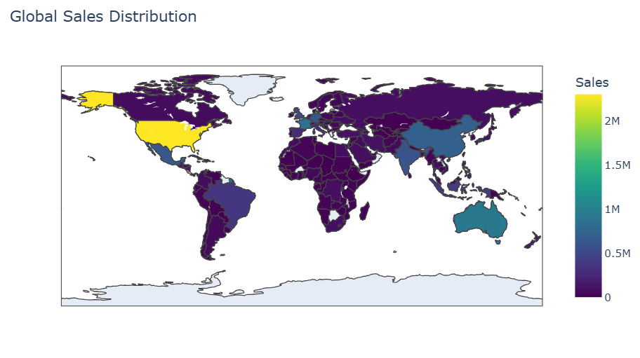

---

# Global Sales Trend Over Time

The time series analysis identifies growth patterns and seasonal fluctuations in sales performance.


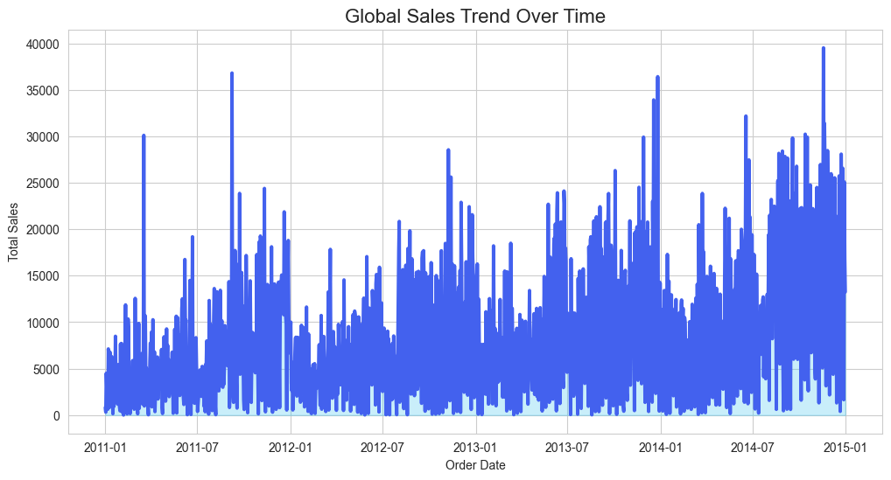

---

# Monthly Sales Heatmap

This heatmap reveals seasonality patterns and identifies peak-performing months.

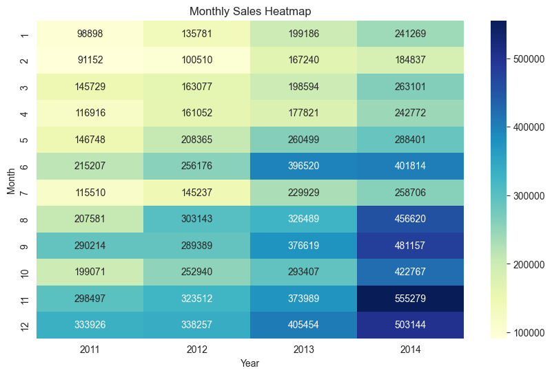

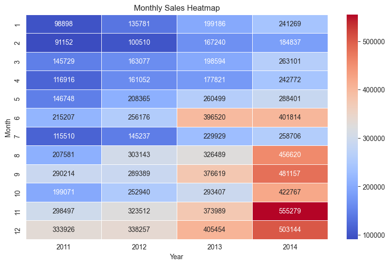

---

# Monthly Sales Trend

Shows long-term growth trajectory and periodic fluctuations.

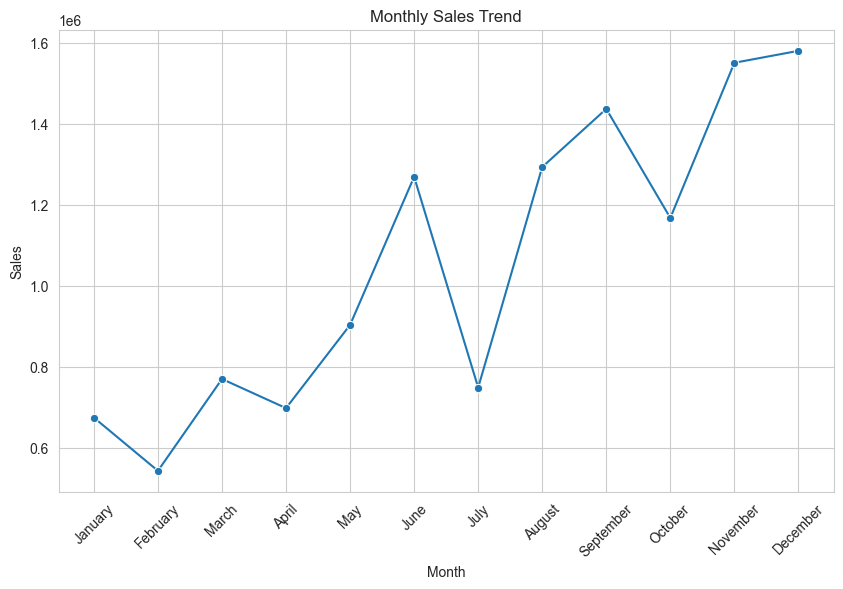

---

# Product Profitability Analysis

This analysis identifies products with high revenue but low profit margins.

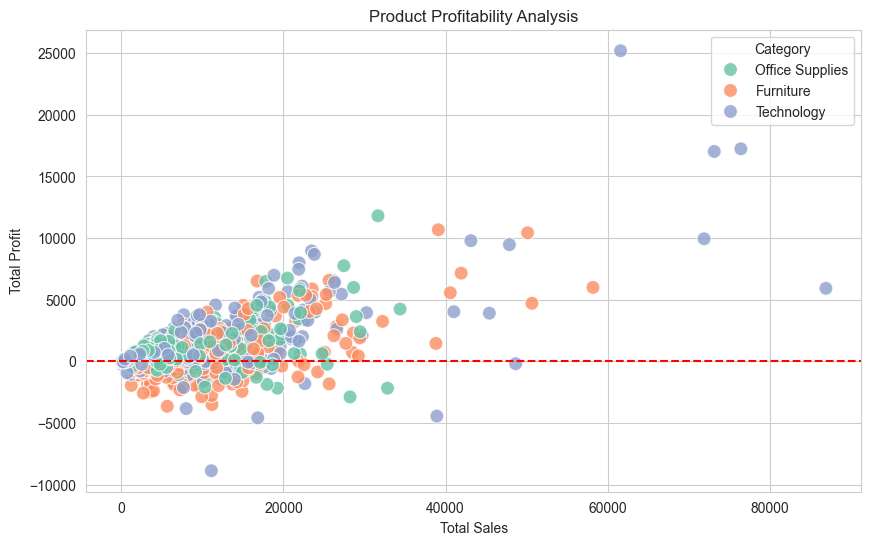

---

# Profitability Quadrant Analysis

Products are categorized into four strategic groups:

* High Sales / High Profit
* High Sales / Low Profit
* Low Sales / High Profit
* Low Sales / Low Profit

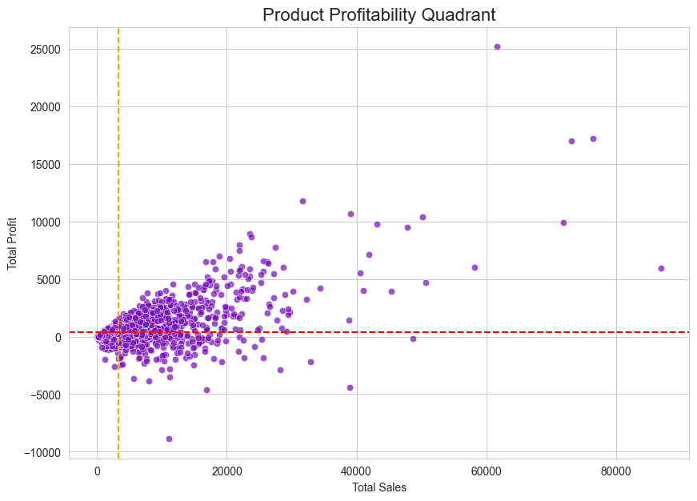

---

# Profit Margin by Category

Highlights which categories generate sustainable profit.

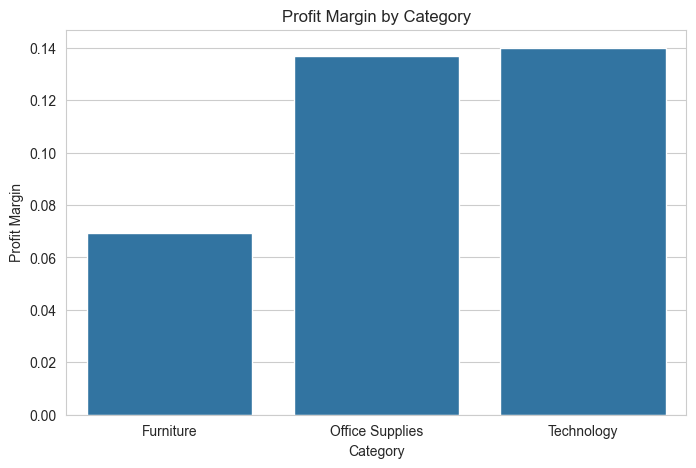

---

# Profit vs Sales Relationship

Identifies products with revenue but weak profitability.

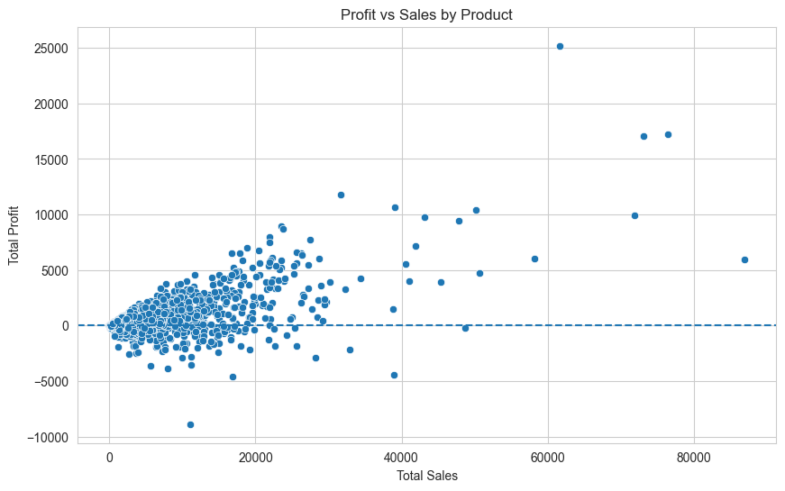

---

# Sales by Category

Technology leads overall revenue contribution.

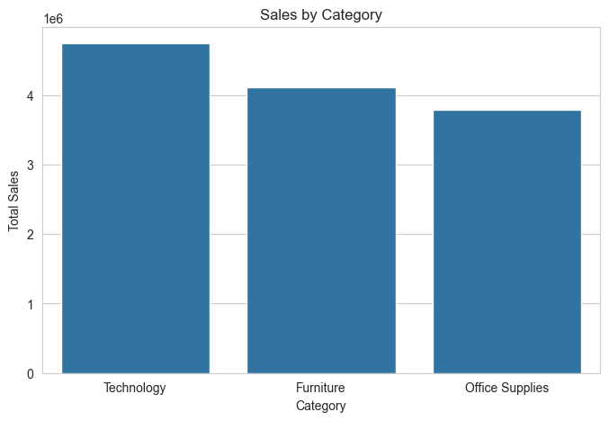

---

# Customer Segment Performance

Consumer segment dominates total sales.

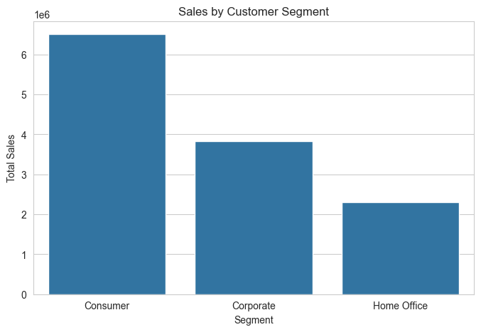

---

# Regional Sales Performance

North America generates highest revenue globally.

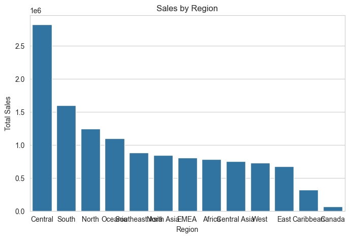

---

# Sales Distribution by Category

Shows proportional revenue share across product categories.

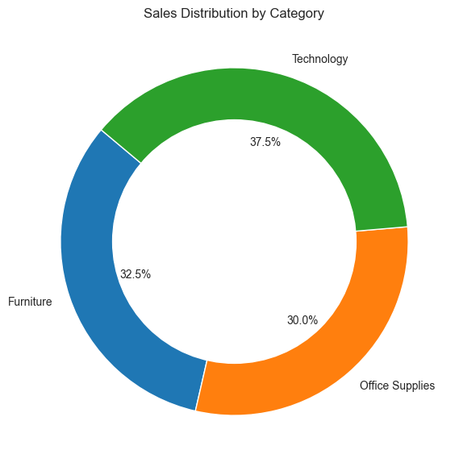

---

# Sales Forecast Prediction

Time-series forecasting indicates continued growth trend.

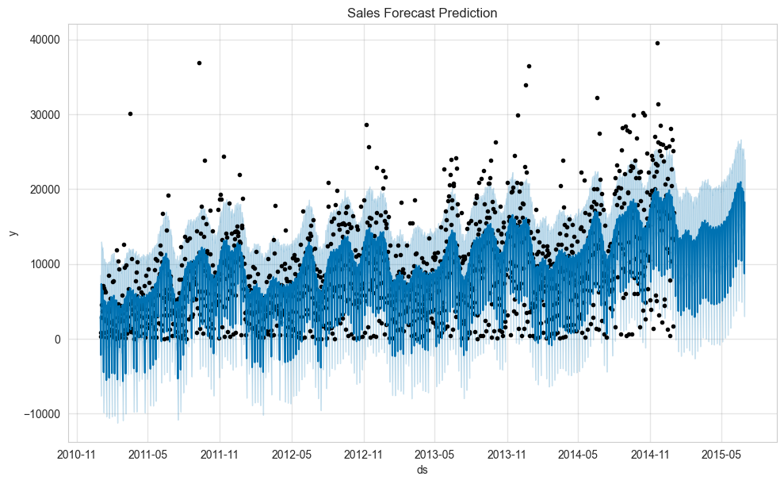

---

# Top Countries by Sales

USA dominates total global sales.

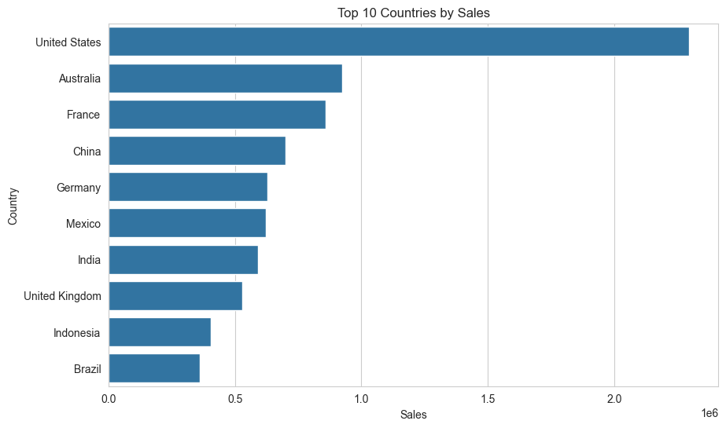

---

# Top Customers by Revenue

Identifies high-value customers contributing to revenue.

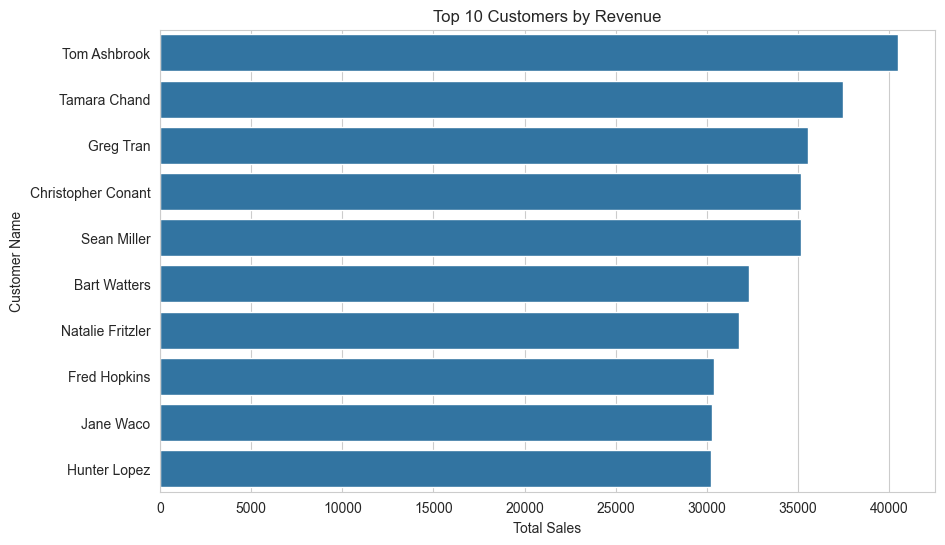

---

# Customer Lifetime Value

Highlights long-term customer contribution.

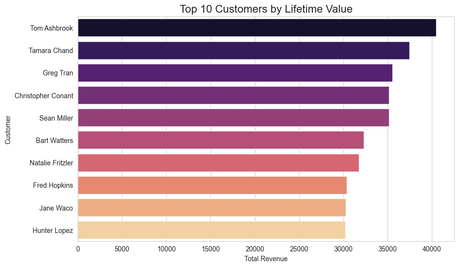

---

# Top Products by Sales

Identifies best-performing products.

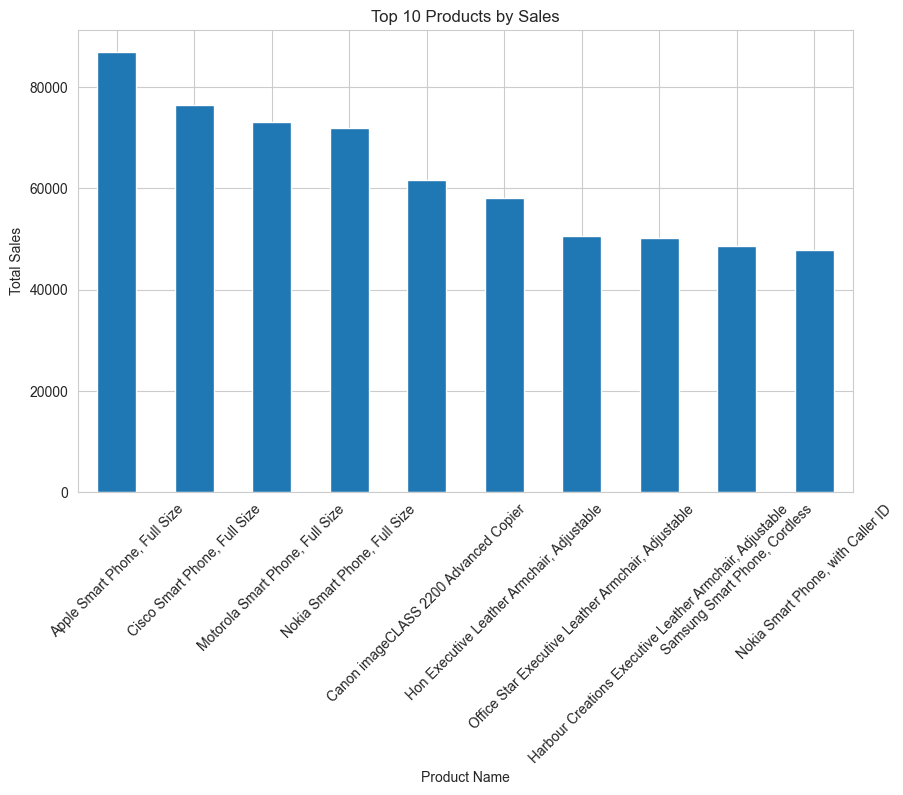

---

# Top Products by Profit

Highlights most profitable products.

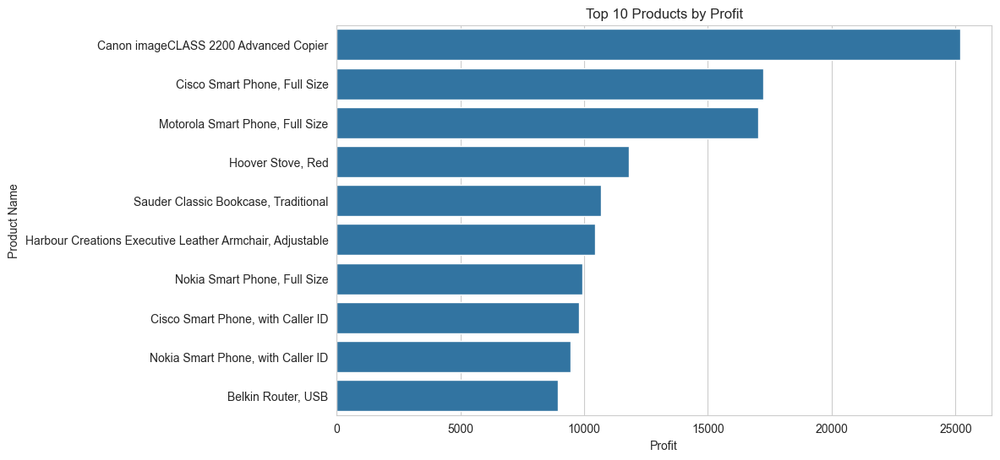

---

# Key Business Insights

* USA generated highest global sales
* Technology category dominated revenue
* Some high-selling products produced low profit
* Africa and Russia showed lower sales contribution
* A small number of customers generated large revenue share
* Forecast indicates continued sales growth
* Profitability varies significantly across categories

---

# Business Value

This project enables stakeholders to:

* Identify high-performing products
* Detect loss-making items
* Optimize pricing strategy
* Understand customer segmentation
* Improve regional sales strategy
* Forecast future demand

---

# Skills Demonstrated

* Data Cleaning
* Exploratory Data Analysis
* Statistical Analysis
* Data Visualization
* Forecasting
* SQL Querying
* Dashboard Design
* Business Storytelling

---

# Project Structure

```
global-ecommerce-analytics-dashboard
│
├── data
├── notebooks
├── sql
├── dashboard
├── images
├── README.md
└── requirements.txt
```

---

# Author

Data Analyst Portfolio Project
Built to demonstrate real-world analytics workflow
