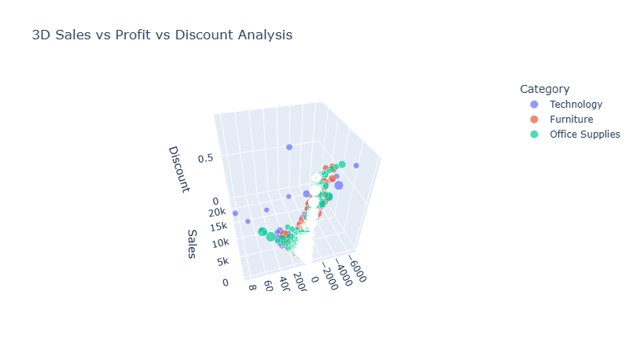
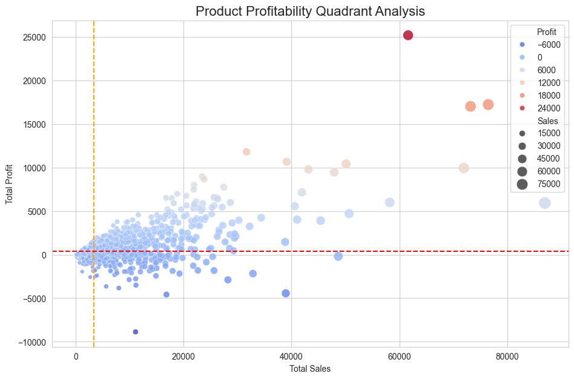
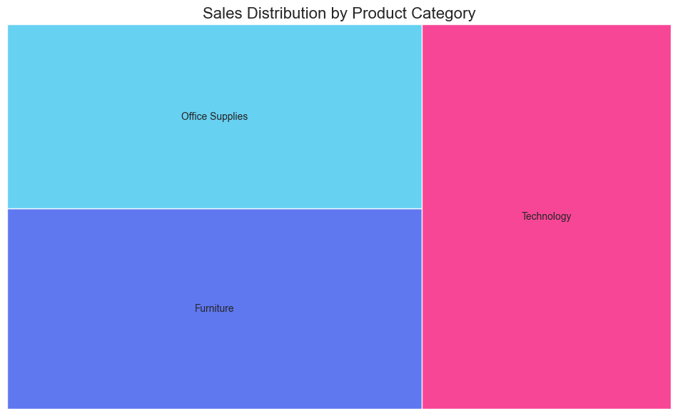
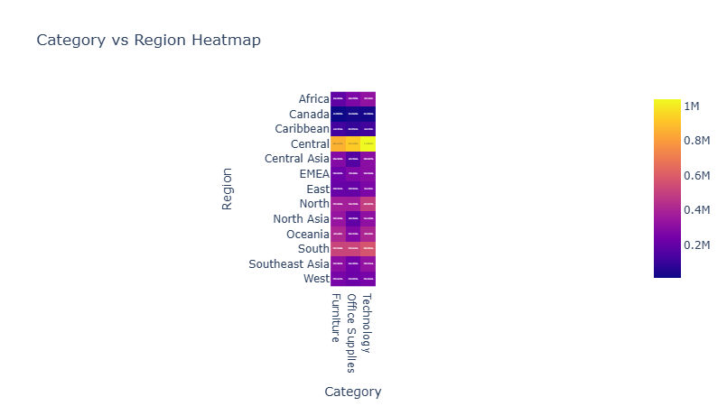
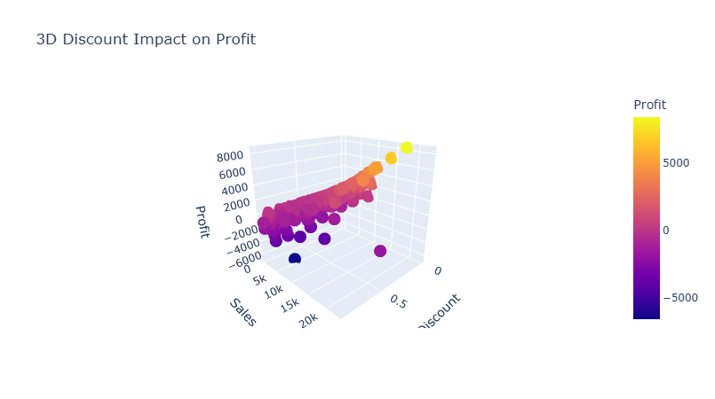
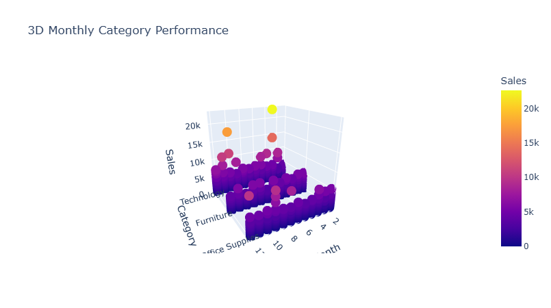
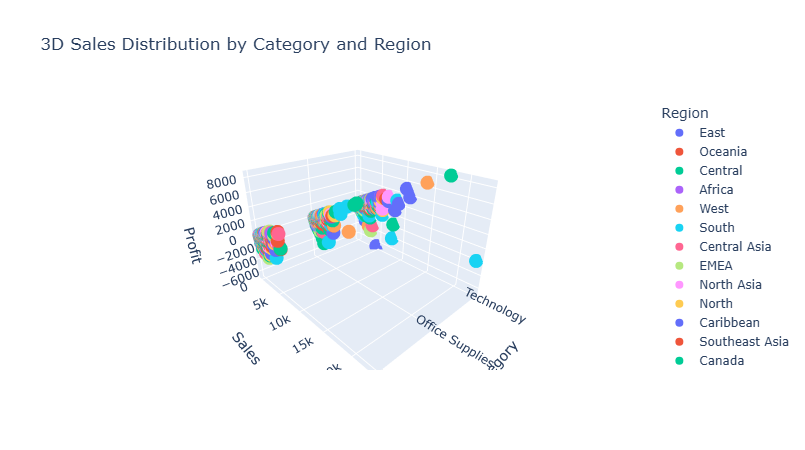
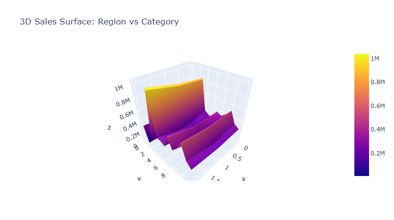

# 🌍 Global E-Commerce Analytics Dashboard

**Created by Rafid Musyaffa**  
🔗 LinkedIn: https://www.linkedin.com/in/rafid-musyaffa-a75079312  
🚀 Live App: https://global-ecommerce-analytics-dashboard-galkazi6wgavuanghw2enz.streamlit.app/  
💻 GitHub Repository: https://github.com/Rafidmusyaffa/global-ecommerce-analytics-dashboard  
📦 Data Source: https://www.kaggle.com/datasets/apoorvaappz/global-super-store-dataset

---

## 3D Analytics Preview



---

## Executive Summary

This project presents a professional **Streamlit-based global e-commerce analytics dashboard** built to explore business performance, identify profitable and loss-making patterns, and generate actionable insights from transactional data.

It transforms raw data into a clear decision-support dashboard with interactive charts, 3D analytics, responsive layout, downloadable reports, and executive-level business storytelling.

The goal is to help stakeholders understand:

- sales performance across regions and categories
- profitable and weak product groups
- customer and segment behavior
- discount and margin risks
- sales trend direction over time
- practical next actions for business growth

---

## Project Overview

This dashboard combines data analysis, visualization, and storytelling into a single clean interface.

It is designed to feel modern and professional on both **desktop and mobile**, with:

- executive summary cards
- image-rich visual sections
- 3D analytics exploration
- AI-style business insight summary
- responsive layout
- cloud deployment support

---

## ✨ Key Features

- Executive Overview Dashboard
- Interactive 3D Analytics Exploration
- AI-style Business Insight Summary
- Dark / Light Mode Toggle
- Responsive Mobile + Desktop Layout
- Floating KPI Cards
- Sticky Sidebar Filters
- Interactive Plotly Charts
- Downloadable Data Export
- Image-rich visual storytelling
- Cloud deployment with Streamlit Community Cloud

---

## 📊 Dashboard Sections

### 1) Overview
A high-level executive view of business performance, including:

- total sales
- total profit
- average discount
- number of orders
- sales by region
- profit by category
- featured visual summaries

### 2) 3D Analytics
An interactive exploration page with:

- category filters
- segment filters
- region filters
- ship mode filters
- 3D scatter analysis
- 3D surface analysis
- drilldown visuals
- downloadable filtered datasets

### 3) AI Insights
A business summary page that explains:

- best and weakest categories
- top regions and segments
- profitability concentration
- discount impact
- business strengths
- risks and warning signals
- recommended next actions
- exportable insight summary

---

## 🖼️ Featured Visuals

This project includes a rich visual set such as:

### Global and Trend Visuals


### Product and Profitability Visuals





### Category and Region Visuals






### Forecast and Top Performers


### 3D Analytics Visuals









---

## 🧰 Tools & Technologies

- Python
- Pandas
- Plotly
- Streamlit
- SQL
- Jupyter Notebook
- Git & GitHub
- Power BI
- Matplotlib
- Seaborn

---

## 🧠 Analysis Workflow

1. Data Cleaning & Preparation  
2. Exploratory Data Analysis  
3. Feature Engineering  
4. Business Insight Generation  
5. SQL Query Analysis  
6. Dashboard Development  
7. Sales Forecasting  
8. Insight Reporting  

---

## 📈 Main Business Questions Answered

- Which categories generate the highest profit?
- Which products generate high sales but low profit?
- Which regions contribute the most revenue?
- Which customer segments perform best?
- How does discounting affect profitability?
- Which products or categories need attention?
- What sales trend is expected in the future?

---

## 🔍 Key Business Insights

- USA generated the highest sales contribution
- Technology was one of the strongest revenue categories
- Some high-selling products showed weaker profit margins
- Several regions contributed less to global revenue
- Customer revenue was concentrated among a small number of top buyers
- Discounting influenced profit behavior in several categories
- Sales forecasting indicated continued growth potential
- Profitability varied significantly across categories and products

---

## 💡 Business Value

This project helps stakeholders:

- identify high-performing products
- detect loss-making items
- optimize pricing strategy
- improve regional sales planning
- understand customer segmentation
- monitor profitability risks
- make future growth decisions using data

---

## 🖥️ Dashboard Pages

### Overview
High-level business performance summary:

- Total Sales
- Total Profit
- Average Discount
- Total Orders
- Sales by Region
- Profit by Category
- Featured Visuals

### 3D Analytics
Interactive exploration:

- Category filter
- Segment filter
- Region filter
- Ship mode filter
- 3D scatter analysis
- 3D surface visualization
- Drilldown insights
- Filtered export

### AI Insights
Business interpretation:

- strongest categories
- weakest performance areas
- profit concentration
- discount impact
- recommended actions
- executive summary export

---

## 📁 Project Structure

```text
global-ecommerce-analytics-dashboard
│
├── app.py
├── app_ui.py
├── streamlit_app.py
├── pages
│   ├── 1_Overview.py
│   ├── 2_3D_Analytics.py
│   └── 3_AI_Insights.py
├── data
├── images
├── notebooks
├── sql
├── requirements.txt
└── README.md